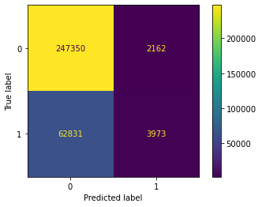

## Load Packages


```python
import plotly
import plotly.graph_objects as go
```


```python
import warnings
warnings.filterwarnings('ignore')
##
import pandas as pd
import numpy as np
import math
import matplotlib.pyplot as plt
from pprint import pprint
import tabulatehelper as th
##
from sklearn import preprocessing
##
from sklearn.model_selection import train_test_split
from sklearn.model_selection import RandomizedSearchCV
from sklearn.model_selection import cross_val_score
##
from sklearn.decomposition import PCA
##
from sklearn.tree import DecisionTreeClassifier  
from sklearn import tree
##
from sklearn.linear_model import LogisticRegression
from sklearn.linear_model import RidgeClassifierCV
##
from sklearn.ensemble import RandomForestClassifier
from sklearn import svm
##
from xgboost import XGBClassifier
##
from sklearn import metrics
from sklearn.metrics import confusion_matrix
from sklearn.metrics import plot_confusion_matrix
##
import dalex as dx
```

## Function


```python
def evaluate(model, test_features, test_labels):
    predictions = model.predict(test_features)
    accuracy = round(metrics.accuracy_score(y_true=test_labels, y_pred=predictions),2)
    fpr, tpr, thresholds = metrics.roc_curve(test_labels, predictions)
    auc = round(metrics.auc(fpr,tpr),2)
    roc_auc = round(metrics.roc_auc_score(y_true=test_labels, y_score=predictions),2)
    roc_auc_score = round(metrics.roc_auc_score(y_true=test_labels, y_score=predictions),2)
    print(f"Accuracy = {accuracy}\n")
    print(f"AUC = {auc}\n")
    print(f"ROC AUC = {roc_auc}\n")
    print(f"ROC AUC SCORE = {roc_auc_score}\n")
    return(accuracy,auc,roc_auc,roc_auc_score)
```


```python
def get_important_features(transformed_features, components_, columns):
    """
    This function will return the most "important" 
    features so we can determine which have the most
    effect on multi-dimensional scaling
    """
    num_columns = len(columns)

    # Scale the principal components by the max value in
    # the transformed set belonging to that component
    xvector = components_[0] * max(transformed_features[:,0])
    yvector = components_[1] * max(transformed_features[:,1])

    # Sort each column by it's length. These are your *original*
    # columns, not the principal components.
    important_features = { columns[i] : math.sqrt(xvector[i]**2 + yvector[i]**2) for i in range(num_columns) }
    important_features = sorted(zip(important_features.values(), important_features.keys()), reverse=True)
    return important_features
```

## Load Data


```python
data_lending_club_default = pd.read_csv('data_lending_club_default.csv',low_memory=False)
cols = [c for c in data_lending_club_default.columns if c.lower()[-5:] != '_cats']
data_lending_club_default=data_lending_club_default[cols]
data_lending_club_default.columns = data_lending_club_default.columns.str.replace("_nums", "")
data_lending_club_default.drop('id', inplace=True, axis=1)
```

## Data Info


```python
data_lending_club_default.info()
```

    <class 'pandas.core.frame.DataFrame'>
    RangeIndex: 1379744 entries, 0 to 1379743
    Data columns (total 65 columns):
     #   Column                      Non-Null Count    Dtype  
    ---  ------                      --------------    -----  
     0   loan_amnt                   1379744 non-null  int64  
     1   int_rate                    1379744 non-null  float64
     2   installment                 1379744 non-null  float64
     3   annual_inc                  1379744 non-null  float64
     4   issue_d                     1379744 non-null  int64  
     5   dti                         1379744 non-null  float64
     6   earliest_cr_line            1379721 non-null  float64
     7   open_acc                    1379721 non-null  float64
     8   revol_bal                   1379744 non-null  float64
     9   revol_util                  1378828 non-null  float64
     10  total_acc                   1379721 non-null  float64
     11  total_pymnt                 1379744 non-null  float64
     12  total_pymnt_inv             1379744 non-null  float64
     13  total_rec_prncp             1379744 non-null  float64
     14  total_rec_int               1379744 non-null  float64
     15  total_rec_late_fee          1379744 non-null  float64
     16  last_pymnt_d                1377332 non-null  float64
     17  last_credit_pull_d          1379687 non-null  float64
     18  tot_cur_bal                 1310142 non-null  float64
     19  total_rev_hi_lim            1310142 non-null  float64
     20  acc_open_past_24mths        1330374 non-null  float64
     21  avg_cur_bal                 1310119 non-null  float64
     22  bc_open_to_buy              1316084 non-null  float64
     23  bc_util                     1315295 non-null  float64
     24  mo_sin_old_il_acct          1271215 non-null  float64
     25  mo_sin_old_rev_tl_op        1310141 non-null  float64
     26  mo_sin_rcnt_rev_tl_op       1310141 non-null  float64
     27  mo_sin_rcnt_tl              1310142 non-null  float64
     28  mort_acc                    1330374 non-null  float64
     29  mths_since_recent_bc        1317040 non-null  float64
     30  mths_since_recent_inq       1200944 non-null  float64
     31  num_accts_ever_120_pd       1310142 non-null  float64
     32  num_actv_bc_tl              1310142 non-null  float64
     33  num_actv_rev_tl             1310142 non-null  float64
     34  num_bc_sats                 1321820 non-null  float64
     35  num_bc_tl                   1310142 non-null  float64
     36  num_il_tl                   1310142 non-null  float64
     37  num_op_rev_tl               1310142 non-null  float64
     38  num_rev_accts               1310141 non-null  float64
     39  num_rev_tl_bal_gt_0         1310142 non-null  float64
     40  num_sats                    1321820 non-null  float64
     41  num_tl_90g_dpd_24m          1310142 non-null  float64
     42  num_tl_op_past_12m          1310142 non-null  float64
     43  pct_tl_nvr_dlq              1309988 non-null  float64
     44  percent_bc_gt_75            1315670 non-null  float64
     45  tot_hi_cred_lim             1310142 non-null  float64
     46  total_bal_ex_mort           1330374 non-null  float64
     47  total_bc_limit              1330374 non-null  float64
     48  total_il_high_credit_limit  1310142 non-null  float64
     49  loan_status                 1379744 non-null  int64  
     50  term                        1379744 non-null  int64  
     51  emp_length                  1379744 non-null  int64  
     52  home_ownership              1379744 non-null  int64  
     53  verification_status         1379744 non-null  int64  
     54  purpose                     1379744 non-null  int64  
     55  verification_status_joint   1379744 non-null  int64  
     56  grade                       1379744 non-null  int64  
     57  sub_grade_A                 1379744 non-null  int64  
     58  sub_grade_B                 1379744 non-null  int64  
     59  sub_grade_C                 1379744 non-null  int64  
     60  sub_grade_D                 1379744 non-null  int64  
     61  sub_grade_E                 1282452 non-null  float64
     62  sub_grade_F                 1379744 non-null  int64  
     63  sub_grade_G                 1379744 non-null  int64  
     64  initial_list_status         1379744 non-null  int64  
    dtypes: float64(48), int64(17)
    memory usage: 684.2 MB
    


```python
data_lending_club_default.isnull().sum()
```


    loan_amnt                  0
    int_rate                   0
    installment                0
    annual_inc                 0
    issue_d                    0
                           ...  
    sub_grade_D                0
    sub_grade_E            97292
    sub_grade_F                0
    sub_grade_G                0
    initial_list_status        0
    Length: 65, dtype: int64


```python
data_lending_club_default = data_lending_club_default.dropna()
data_lending_club_default.isnull().sum()
```


    loan_amnt              0
    int_rate               0
    installment            0
    annual_inc             0
    issue_d                0
                          ..
    sub_grade_D            0
    sub_grade_E            0
    sub_grade_F            0
    sub_grade_G            0
    initial_list_status    0
    Length: 65, dtype: int64


```python
data_lending_club_default['loan_status'].value_counts()
```


    0    830960
    1    223424
    Name: loan_status, dtype: int64


```python
print("%.2f" % round(223424/len(data_lending_club_default.index), 2))
```

    0.21
    

## Graph


```python

```

## Split Data


```python
X = data_lending_club_default.drop('loan_status', axis=1)
y = data_lending_club_default.loan_status
```

## Correlation


```python
corr = X.corr()
features_corr = ~(corr.mask(np.eye(len(corr), dtype=bool)).abs() > 0.3).any()
features_corr
```


    loan_amnt              False
    int_rate               False
    installment            False
    annual_inc             False
    issue_d                False
                           ...  
    sub_grade_D            False
    sub_grade_E             True
    sub_grade_F            False
    sub_grade_G             True
    initial_list_status    False
    Length: 64, dtype: bool


```python
X_good = corr.loc[features_corr, features_corr]
lst_variable_corr = X_good.columns.values.tolist()
X_corr = X[np.intersect1d(X.columns, lst_variable_corr)]
df_corr = X[X_corr.columns]
print(th.md_table(df_corr.head(),formats={-1: 'c'}))
```

|   emp_length |   mths_since_recent_inq |   purpose |   sub_grade_E |   sub_grade_G |   total_rec_late_fee |   verification_status |   verification_status_joint |
|-------------:|------------------------:|----------:|--------------:|--------------:|---------------------:|----------------------:|:---------------------------:|
|           11 |                       4 |         9 |             0 |             0 |                    0 |                     0 |                           0 |
|           11 |                       0 |         3 |             0 |             0 |                    0 |                     0 |                           0 |
|           11 |                      10 |         7 |             0 |             0 |                    0 |                     0 |                           0 |
|            4 |                       1 |         6 |             0 |             0 |                    0 |                     1 |                           0 |
|           11 |                      10 |         9 |             0 |             0 |                    0 |                     0 |                           0 |
    

## PCA


```python
pca = PCA(n_components=14, svd_solver='full')
pca.fit(X)
T = pca.transform(X)
T.shape
```


    (1054384, 14)


```python
pca.explained_variance_ratio_
```


    array([8.47684413e-01, 6.35440344e-02, 4.12811786e-02, 2.58817139e-02,
           9.32454435e-03, 4.75106489e-03, 3.83054499e-03, 1.33970838e-03,
           8.98406429e-04, 8.08620064e-04, 3.14865578e-04, 2.63573857e-04,
           7.39575398e-05, 3.08489023e-06])


```python
components = pd.DataFrame(pca.components_, columns = X.columns, index=[1,2,3,4,5,6,7,8,9,10,11,12,13,14])
pca_result = get_important_features(T, pca.components_, X.columns.values)
pca_result = pd.DataFrame(pca_result,columns=['PCA_Value','Variable'])
pca_result = pca_result[pca_result["PCA_Value"] >= 75]
print(th.md_table(pca_result,formats={-1: 'c'}))
```

|        PCA_Value | Variable                   |
|-----------------:|:--------------------------:|
|      9.64516e+06 | annual_inc                 |
|      7.9843e+06  | tot_hi_cred_lim            |
|      7.16197e+06 | tot_cur_bal                |
|      2.42967e+06 | total_bal_ex_mort          |
|      2.01028e+06 | total_il_high_credit_limit |
|      1.22694e+06 | total_rev_hi_lim           |
| 757233           | revol_bal                  |
| 711373           | total_bc_limit             |
| 648939           | avg_cur_bal                |
| 314991           | total_pymnt                |
| 314912           | total_pymnt_inv            |
| 312182           | bc_open_to_buy             |
| 310222           | loan_amnt                  |
| 270905           | total_rec_prncp            |
|  40408.8         | total_rec_int              |
|   9312.46        | installment                |
|   1143.48        | mo_sin_old_rev_tl_op       |
|    679.885       | mo_sin_old_il_acct         |
|    262.909       | total_acc                  |
|    151.347       | num_il_tl                  |
|    132.093       | dti                        |
|    114.609       | percent_bc_gt_75           |
|    110.148       | open_acc                   |
|    109.824       | num_sats                   |
|     95.2199      | num_rev_accts              |
|     87.9602      | earliest_cr_line           |
|     86.4383      | revol_util                 |
    


```python
X_pca = pca_result['Variable']
df_pca = X[X_pca]
print(th.md_table(df_pca.head(),formats={-1: 'c'}))
```

|   annual_inc |   tot_hi_cred_lim |   tot_cur_bal |   total_bal_ex_mort |   total_il_high_credit_limit |   total_rev_hi_lim |   revol_bal |   total_bc_limit |   avg_cur_bal |   total_pymnt |   total_pymnt_inv |   bc_open_to_buy |   loan_amnt |   total_rec_prncp |   total_rec_int |   installment |   mo_sin_old_rev_tl_op |   mo_sin_old_il_acct |   total_acc |   num_il_tl |   dti |   percent_bc_gt_75 |   open_acc |   num_sats |   num_rev_accts |   earliest_cr_line |   revol_util |
|-------------:|------------------:|--------------:|--------------------:|-----------------------------:|-------------------:|------------:|-----------------:|--------------:|--------------:|------------------:|-----------------:|------------:|------------------:|----------------:|--------------:|-----------------------:|---------------------:|------------:|------------:|------:|-------------------:|-----------:|-----------:|----------------:|-------------------:|:------------:|
|        55000 |            178050 |        144904 |                7746 |                        13734 |               9300 |        2765 |             2400 |         20701 |       4421.72 |           4421.72 |             1506 |        3600 |              3600 |          821.72 |        123.03 |                    128 |                  148 |          13 |           3 |  5.91 |                0   |          7 |          7 |               9 |                 16 |         29.7 |
|        65000 |            314017 |        204396 |               39475 |                        24667 |             111800 |       21470 |            79300 |          9733 |      25679.7  |          25679.7  |            57830 |       24700 |             24700 |          979.66 |        820.28 |                    192 |                  113 |          38 |           6 | 16.06 |                7.7 |         22 |         22 |              27 |                 20 |         19.2 |
|        63000 |            218418 |        189699 |               18696 |                        14877 |              14000 |        7869 |             6200 |         31617 |      22705.9  |          22705.9  |             2737 |       20000 |             20000 |         2705.92 |        432.66 |                    184 |                  125 |          18 |           6 | 10.78 |               50   |          6 |          6 |               7 |                 19 |         56.2 |
|       104433 |            439570 |        331730 |               95768 |                        88097 |              34000 |       21929 |            20300 |         27644 |      11740.5  |          11740.5  |             4567 |       10400 |             10400 |         1340.5  |        289.91 |                    210 |                  128 |          35 |          10 | 25.37 |               60   |         12 |         12 |              19 |                 21 |         64.5 |
|       180000 |            388852 |        360358 |              116762 |                        46452 |              94200 |       87329 |            31500 |         30030 |      21393.8  |          21393.8  |                0 |       20000 |             20000 |         1393.8  |        637.58 |                    306 |                  142 |          27 |           7 | 14.67 |              100   |         12 |         12 |              16 |                 29 |         84.5 |
    

## Split Dataset 


```python
X_train, X_test, y_train, y_test = train_test_split(df_corr, y, test_size=0.3, random_state=1)
```

### Logistic Regression


```python
clf_logit = LogisticRegression()
clf_logit.fit(X_train,y_train)
y_pred_logit = clf_logit.predict(X_test)
score_logistics_regression = round(metrics.accuracy_score(y_true=y_test, y_pred=y_pred_logit),2)
score_logistics_regression
```


    0.79


```python
exp_logit = dx.Explainer(clf_logit, X_train, y_train)
mp_logit = exp_logit.model_performance(model_type = 'classification')
print(th.md_table(mp_logit.result,formats={-1: 'c'}))
```

    Preparation of a new explainer is initiated
    
      -> data              : 738068 rows 8 cols
      -> target variable   : Parameter 'y' was a pandas.Series. Converted to a numpy.ndarray.
      -> target variable   : 738068 values
      -> model_class       : sklearn.linear_model._logistic.LogisticRegression (default)
      -> label             : Not specified, model's class short name will be used. (default)
      -> predict function  : <function yhat_proba_default at 0x0000027B6318D820> will be used (default)
      -> predict function  : Accepts pandas.DataFrame and numpy.ndarray.
      -> predicted values  : min = 0.106, mean = 0.212, max = 1.0
      -> model type        : classification will be used (default)
      -> residual function : difference between y and yhat (default)
      -> residuals         : min = -1.0, mean = 1.66e-06, max = 0.892
      -> model_info        : package sklearn
    
    A new explainer has been created!
|   recall |   precision |       f1 |   accuracy |      auc |
|---------:|------------:|---------:|-----------:|:--------:|
| 0.060286 |    0.659911 | 0.110479 |   0.793997 | 0.622691 |
    


```python
fig_mp_logit = mp_logit.plot()
fig_mp_logit
plotly.io.write_json(fig_mp_logit,"C:\\Users\\piotr\\Desktop\\Git\\nsvceodeveloper\\static\\plotly\\mp_logit.json") # wywalic
```





```python
vi_logit = exp_logit.model_parts()
print(th.md_table(vi_logit.result,formats={-1: 'c'}))
```

| variable                  |   dropout_loss | label              |
|:--------------------------|---------------:|:------------------:|
| verification_status_joint |       0.390452 | LogisticRegression |
| purpose                   |       0.394898 | LogisticRegression |
| _full_model_              |       0.394918 | LogisticRegression |
| sub_grade_E               |       0.394918 | LogisticRegression |
| sub_grade_G               |       0.402588 | LogisticRegression |
| mths_since_recent_inq     |       0.408197 | LogisticRegression |
| emp_length                |       0.41058  | LogisticRegression |
| verification_status       |       0.415257 | LogisticRegression |
| total_rec_late_fee        |       0.433648 | LogisticRegression |
| _baseline_                |       0.498272 | LogisticRegression |
    


```python
fig_vi_logit = vi_logit.plot(max_vars=10)
fig_vi_logit
plotly.io.write_json(go.Figure(vi_logit.plot(max_vars=10)),"C:\\Users\\piotr\\Desktop\\Git\\nsvceodeveloper\\static\\plotly\\vi_logit.json") # wywalic
```





```python
pdp_num = exp_logit.model_profile(type = 'partial', label="pdp")
ale_num = exp_logit.model_profile(type = 'accumulated', label="ale")
pdp_num.plot(ale_num))
```

    Calculating ceteris paribus: 100%|███████████████████████████████████████████████████████| 8/8 [00:00<00:00, 40.20it/s]
    Calculating ceteris paribus: 100%|███████████████████████████████████████████████████████| 8/8 [00:00<00:00, 22.66it/s]
    Calculating accumulated dependency: 100%|████████████████████████████████████████████████| 8/8 [00:01<00:00,  6.32it/s]
  




```python
score_val_logit = cross_val_score(clf_logit, X_test, y_test, cv=5)
score_val_logit
```


    array([0.79354767, 0.79431895, 0.79457187, 0.79484059, 0.79482478])


```python
conf_m_logit = metrics.confusion_matrix(y_test, y_pred_logit)
conf_m_logit
```


    array([[247350,   2162],
           [ 62831,   3973]], dtype=int64)


```python
plot_confusion_matrix(clf_logit, X_test, y_test) 
plt.show()  
```


    

    

